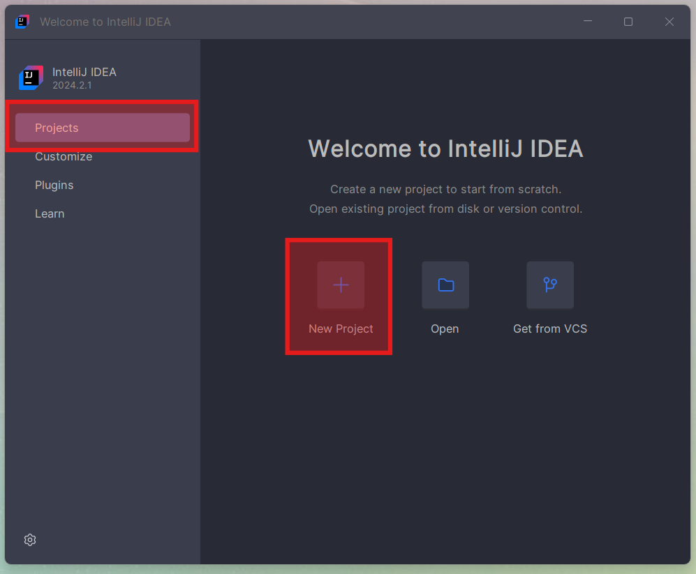
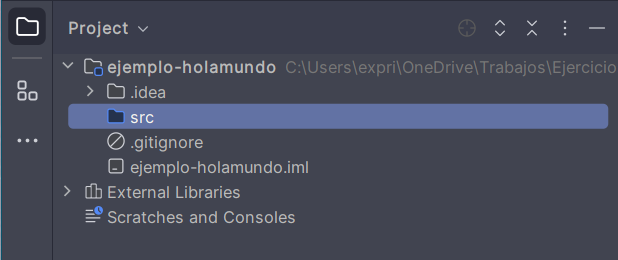
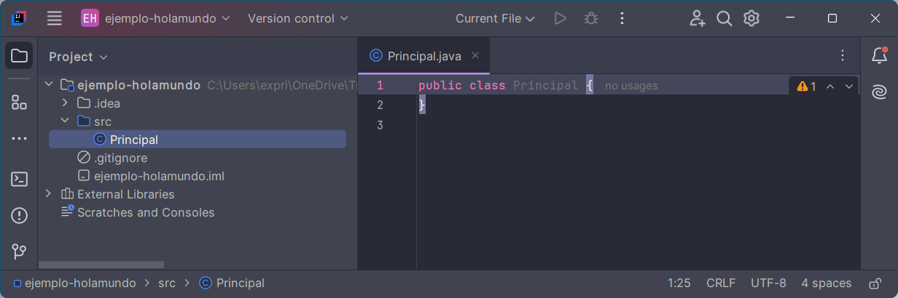
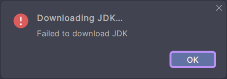

# Índice

[TOC]

---

# 🟪¿Qué es un IDE?

Ahora mismo somos un descampado y por algo tendremos que empezar ¿verdad? Pues vamos a empezar por preparar el entorno en el que trabajaremos durante todo el curso para que vayamos familiarizándonos con las herramientas que usaremos.  

Un **IDE** (Entorno de Desarrollo Integrado) es una suite de software que combina herramientas esenciales para facilitar el desarrollo de aplicaciones. Estas herramientas incluyen:

- **Editor de código**: Un editor de texto especializado para escribir el código fuente. Nos ayudará con autocompletado y resaltado de código.
- **Compilador**: Traduce el código fuente a un lenguaje que la máquina pueda entender.
- **Depurador**: Permite probar y encontrar errores en el código.
- **Automatización de tareas**: Herramientas que automatizan tareas repetitivas, como la compilación y pruebas.

Los IDEs están diseñados para aumentar la productividad del programador al integrar todas estas herramientas en una sola interfaz gráfica de usuario (GUI), lo que facilita la escritura, prueba y depuración del código.

En este módulo te guiaremos a dar tus primeros pasos según el IDE que hayamos decidido usar durante el curso. 

# 🟪Instalación IntelliJ IDEA

**IntelliJ IDEA** es un IDE muy popular desarrollado por JetBrains, especialmente diseñado para el desarrollo en Java y Kotlin. Posee dos versiones:

- **IntelliJ IDEA Ultimate** es la versión de pago que ofrece un conjunto completo de herramientas avanzadas para el desarrollo profesional, incluyendo soporte para una amplia gama de frameworks, herramientas de desarrollo web y empresarial, y características avanzadas de depuración y análisis de código.
- **IntelliJ IDEA Community Edition** es la versión gratuita y de código abierto, **ideal para estudiantes** y desarrolladores de proyectos pequeños. Incluye las herramientas esenciales para el desarrollo en Java y otros lenguajes, pero carece de las características avanzadas y soporte para frameworks empresariales (Spring Boot, bases de datos, web, etc.) que se encuentran en la versión Ultimate.

## Descargar

Pulsa el siguiente botón para descargar la versión Community Edition de la página de JetBrains (600Mb aproximadamente).

<div style="text-align: center; padding: 3rem">
    <a href="https://www.jetbrains.com/idea/download/download-thanks.html?code=IIC" target="_blank" 
       style="background-color: #007ACC; color: white; padding: 1rem 2rem; border: none; border-radius: 5px; text-decoration: none; transition: background-color 0.3s;">
        
        Descargar IntelliJ IDEA Community Edition
    </a>
</div>

> [!NOTE]
>
> Si no funciona el botón, puedes descargarlo de https://www.jetbrains.com/idea/download/. Este es la página de descarga la versión Ultimate y Community, asegúrate de elegir la adecuada.


## Instalación

Para instalarlo, haz doble clic sobre el instalador y sigue las instrucciones del asistente:


> [!TIP]
>
> Al marcar estas casillas durante la instalación, indicamos en orden que: Queremos un icono de acceso directo en el escritorio, que queremos que nos salga la opción contextual de “Abrir carpeta como proyecto” y asociamos los archivos `.java` al IntelliJ. Todas son sugerencias y si sabemos lo que hacemos, podemos elegir las opciones a nuestro gusto.


## Puesta en marcha

Una vez instalado, nos preguntará si queremos abrirlo, y después de aceptar los términos de licencia, llegaremos a la pantalla principal, desde aquí veremos los proyectos recientes y crearemos los nuevos proyectos. Por ahora no hacemos nada, pero esta pantalla será el punto de partida de todo.


## Configuración recomendada

Como primer paso dentro de IntelliJ IDEA, haremos los siguientes cambios en los ajustes. Igualmente son todos opcionales, pero son recomendables.

Para acceder a los ajustes, tenemos dos opciones:

- Si estamos en la pantalla de bienvenida, pulsaremos `Customize ` > ` All settings... ` y aparecerá la ventana de `Settings`.
- Si tenemos un proyecto abierto, en `File` > `Settings...`.


Una vez abierta la ventana de **Settings**, recomendamos los siguientes ajustes:

- **Diccionario ortográfico**: Nos vamos a `Editor ` > ` Natural Languages` , y en la lista de lenguajes, pulsamos el botón ➕. Podemos añadir varios diccionarios, si vamos a escribir en varios idiomas.
- **Codificación en UTF-8:** Para establecer que todos los archivos creados se codifiquen en utf-8, `Editor` > `File Encodings` > Y poner `Global Encoding`, `Project Encoding` y `Properties Files` en **UTF-8**.

## Plugins 

Para instalar plugins, en la pantalla de bienvenida, pulsaremos el botón de `Plugins`. Saldrá un buscador, y tan solo tendremos que buscar los plugins que queramos, e instalarlos. Posiblemente tendremos que reiniciar el IDE tras instalar uno. 

- **[Rainbow Brackets](https://plugins.jetbrains.com/plugin/10080-rainbow-brackets):** Pone cada par de paréntesis, llaves, corchetes, etiquetas, etc, del mismo color. Muy útil para identificar rápidamente bloques.

- **Cualquier tema de colores:** Puedes personalizar el IDE completo (colores, iconos, etc) con los temas más comunes como Dracula, Solarized Theme, Monokai, etc.
  - [**Tema Dracula**](https://plugins.jetbrains.com/plugin/12275-dracula-theme): Tema oscuro recomendado, colores resultones y nada molestos. Se le puede instalar el mismo tema a Visual Studio. 🤓 Es el tema usado en la captura anterior.
  
  - **[Atom Material Icons](https://plugins.jetbrains.com/plugin/10044-atom-material-icons):** Un pack de iconos que es muy útil para diferencias las carpetas de los proyectos, tanto Java como Angular.
  
- Es un IDE tan completo, que no es necesario instalarle ningún plugin adicional de inicio. ¡Seguro que durante el curso descubrimos alguno muy chulo! 🥰. 


## Hola Mundo! (IntelliJ)

Una vez configurado el entorno, vamos a crear nuestra primera aplicación y hacerla funcionar, para asegurarnos que todo está bien instalado y no tendremos futuros problemas.

> [!IMPORTANT]
>
> A continuación veremos los pasos para crear un nuevo proyecto Java usando IntelliJ. Además también explicaremos pasos adicionales que únicamente tendrán que hacerse una vez, como instalar la JDK de Java.

### Nuevo proyecto

Vamos a ver los pasos usando IntelliJ:

1. En la pantalla de bienvenida, hacemos clic en el botón de `Projects` > `New Project`.
    
2. Nos aparecerá la siguiente ventana:
    
  
3. A la izquierda podemos elegir el tipo de proyecto que queremos. En nuestro caso siempre será **Java** y será la opción por defecto, por lo que no tenemos que tocar ahí nada.
4. A la derecha, por orden, en el campo <kbd>Name</kbd> ponemos el nombre del proyecto. Esto creará una carpeta con el mismo nombre en la ubicación elegida en la casilla de <kbd>Location</kbd>. En esa carpeta se ubicarán todos los archivos de nuestro proyecto. Se aconseja no usar caracteres especiales. Podemos usar por ejemplo `ejemplo-holamundo`.
5. Dejamos las casilla de <kbd>Create Git Repository</kbd> sin marcar y como <kbd>Build system</kbd> IntelliJ.
6. En la casilla de <kbd>JDK</kbd>, como es nuestro primer proyecto, y no tenemos ninguna JDK instalada (ya veremos más adelante que es), nos da la opción de descargarla automáticamente por nosotros. En los siguientes proyectos ya saldrá ahí la versión que se descargue ahora. No tenemos que hacer nada.
7. Dejamos las casillas de <kbd>Add sample code</kbd> y <kbd>Generate code with onboarding tips</kbd> desmarcadas. Tal y como se ve en la captura. 
8. Pulsamos en <kbd>Create</kbd> para se genere nuestro primer proyecto Java.

> [!CAUTION]
>
> Si te da algún error al descargar la JDK, ve al apartado [Errores comunes](#Errores comunes).

### Estructura proyecto

Una vez que tenemos el proyecto creado (y sin errores de la JDK) podemos seguir para ver la estructura común de un proyecto Java con IntelliJ.



**Solo vamos a usar la carpeta <kbd>src</kbd>.** Ahí es donde colocaremos todos los archivos `.java` que conformarán nuestro proyecto. El resto son carpetas de configuración de IntelliJ, de Git y las librerías de la JDK de Java, **que no tocaremos nunca nada de ahí**.

### Añadiendo código

Para crear nuestro primer archivo Java, pulsaremos **botón derecho del ratón sobre la carpeta `src`**, y seleccionamos `New` > `Java Class`. Nos saldrá un pequeño asistente para crear una nueva clase Java (ya veremos más adelante con detenimiento qué es una clase). 


En esta ventana, tan sólo le indicaremos el nombre de la clase en el cuadro <kbd>Name</kbd>. El nombre de una clase **SIEMPRE EMPIEZA CON LA PRIMERA LETRA EN MAYÚSCULA**, y el resto en minúsculas. Por ejemplo, nuestra clase se puede llamar `Principal`.



Esto nos creará el archivo `Principal.java` dentro del proyecto, con el siguiente contenido:

```java
public class Principal {
}
```

Vamos a añadir unas líneas al código anterior para poder ejecutar nuestro primer programa. Modifícala para que tenga el siguiente contenido **EXACTO**: 

```java
public class Principal {
    public static void main(String[] args) {
        System.out.println("¡¡¡ Hola mundo !!!");
    }
}
```

> [!TIP]
>
> Si aparecen líneas rojas o amarillas debajo de tu código es que has cometido algún error. Fíjate bien 🧐.

>  [!CAUTION]
>
>  🚨**MUY IMPORTANTE**🚨No podremos por ahora, escribir nada fuera de las llaves del método `main`. Todo se explicará en su debido momento ⏳, se paciente.

### Ejecutar la aplicación

En este punto, ya podemos pasar a ejecutar la aplicación. Tenemos varias formas de ejecutar una aplicación Java. Empecemos con una y después iremos viendo más.

Pulsa en el botón de reproducir ▶️ en la parte central de la ventana de título. Esto hará que el IDE compile el proyecto y nos abra una nueva sección en el IDE con la **consola de Java**. 

**En la consola de Java podemos ver el resultado de la ejecución del proyecto**.


### Cerrar el proyecto

Si cerramos la ventana de IntelliJ con el proyecto abierto, al volver a abrir IntelliJ se volverá a abrir automáticamente el proyecto abierto para que sigamos trabajando con él. 

Una vez que hemos terminado con un proyecto, **debemos cerrarlo para poder abrir otros**. 

Para cerrarlo pulsamos en  `File > Close Project`.

Se cerrará el proyecto actual y volverá a la pantalla de bienvenida, donde podremos crear nuevos proyectos o abrir los existentes.


> [!TIP]
>
> La lista que nos muestra no es la carpeta con los proyectos, si no una lista de los proyectos que hemos abierto recientemente. 
>
> Para abrir un proyecto cualquiera que no esté en la lista:
>
> - Pulsamos <kbd>Open</kbd> y lo buscamos manualmente en nuestro sistema de archivos. 
> - En nuestro sistema de archivos, clic derecho del ratón sobre la carpeta de un proyecto y seleccionar <kbd>Open folder as IntelliJ project</kbd>.


### Errores comunes

> [!NOTE]
>
> 🍀Si todo ha salido bien, salta ésta sección.

Es posible que al descargar o instalar la JDK de forma automática, te muestre algún error y no funcione el proyecto.



Sigue estos pasos para instalarla de forma manual:

- Con el proyecto que te falla abierto, ve a `File` > `Project Structure`.
- En `Project Settings` > `Project` > `SDK` > `Edit`.
- Desde ahí borra las SDK que se hayan descargado (selecciona y pulsa ➖). Añade una nueva SDK con ➕ y que se descarguen. Preferiblemente la última versión que haya de la OpenJDK de Oracle.
- Si sigue fallando, cierra todo IntelliJ y ve a `C:/users/<tu usuario de windows>/.jdks`. Borra el contenido de esa carpeta, vuelve a abrir IntelliJ y repite el proceso.
- Cuando se arregle en este proyecto, ya funcionará bien para el resto de proyectos.


---

# 🟪Instalación Spring Tool Suite

Normalmente para aprender Java se usa Eclipse. Si después queremos usar Spring Framework y Spring Boot, se usa una versión modificada de Eclipse llamada Spring Tool Suite. Como podemos usar Spring Tool Suite para todo lo que se verá en el curso, lo usaremos desde el principio y así tendremos el mismo IDE durante todo el curso, para ver JavaSE, JavaEE, Spring y Spring Boot. Además Spring Tool Suite trae la JDK y JRE de Java preinstalada y así no necesitamos instalar nada más, evitando problemas multiplataforma.

## Descargar

Encontraremos la última versión de Spring Tool Suite en la siguiente dirección:

https://spring.io/tools

## Descomprimir

El archivo descargado viene comprimido en `zip`. Habrá que descomprimir su contenido y obtendremos una carpeta llamada `/sts-4.x.x.RELEASE`. La podremos mover a la ubicación que deseemos ya que es una versión portable que ya trae una JDK open source lista para empezar.

## Puesta en marcha

Para arrancar la aplicación deberemos ejecutar el archivo `SpringToolSuite4.exe` que hay en la carpeta final. La primera vez que arrancamos STS nos preguntará la ubicación de nuestro directorio de trabajo (*workspace*). 


Podemos seleccionar que use la ruta indicada como ruta por defecto y ya no nos volverá a preguntar. Siempre podremos cambiar esto más adelante.

## Preferencias recomendadas

Entraremos en *Window -> Preferences*, y ahí:

- **Tema oscuro:** Cansa menos la vista. *General -> Appearance -> Theme Dark*.
- **Corrector ortográfico:** Por defecto ya está activado y en inglés. Podemos añadirle un diccionario manualmente en *General -> Editors -> Text Editors -> Spelling -> Dictionaries -> Browse ->* Y elegimos el diccionario en español que podemos [descargar de aquí](https://github.com/borilio/curso-javase/tree/master/assets/diccionario). Seleccionar la codificación UTF-8 para el diccionario para que funcione correctamente.
- **Auto Save**: Configurar que los archivos se vayan guardando automáticamente cada pocos segundos y nos evitaremos sorpresas. *General -> Editors -> Autosave -> Enable autosave* y le indicamos el intervalo en segundos.
- **Ampliar buffer de la consola:** Por defecto, la salida por consola viene con un buffer pequeño, el cual la primera vez que ejecutemos una aplicación, nos dará un aviso. Si lo arreglamos desde ya, no tendremos luego interrupciones. Vamos a *Run/Debug -> Console -> Marcamos "Limit console output" y establecemos "Console buffer size (characters)"* a un valor más alto, 1.000.000 aprox. También podemos desactivar el límite. No habría diferencia de rendimiento visible entre las dos opciones.


## Hola Mundo! (STS)

Una vez configurado el entorno, vamos a crear nuestra primera aplicación y hacerla funcionar, para asegurarnos que todo está bien instalado y no tendremos futuros problemas.

### Nuevo proyecto

Vamos a ver los pasos usando Spring Tool Suite 4.

1. Iniciamos el asistente con **File -> New -> Java project**

2. Sólo deberemos indicarle el nombre del proyecto en la casilla de “Project name”. Esto creará una carpeta con el mismo nombre en el workspace indicado previamente. En esa carpeta de ubicarán todos los archivos de nuestro proyecto. Se aconseja no usar caracteres especiales. Podemos usar por ejemplo `ejemplo-holamundo`.
3. Desactivamos la casilla de `Create module-info.java file`.
4. Pulsamos `Finish` y ya tendremos el proyecto creado. 


### Estructura de proyecto

Nos habrá creado una proyecto con la siguiente estructura:


Veremos primero las librerías del sistema de Java (JRE System Library), que no tendremos que tocar nada y una carpeta llamada `src` donde añadiremos todo nuestro código Java.

### Añadiendo código

Para crear nuestro primer archivo Java, pulsaremos **botón derecho del ratón sobre la carpeta `src`**, y seleccionamos *New -> Class*. Nos saldrá un asistente para crear una nueva clase Java (ya veremos más adelante con detenimiento qué es una clase).


En esta ventana, tan sólo le indicaremos el nombre de la clase en el cuadro “**Name**”. El nombre de una clase **SIEMPRE EMPIEZA CON LA PRIMERA LETRA EN MAYÚSCULA**, y el resto en minúsculas. Por ejemplo, nuestra clase se puede llamar `Principal`.

Le marcamos la opción `public static void main(String[] args)`. Ya se explicará más adelante. Y pulsamos **Finish**.


Esto nos creará el archivo `Principal.java` dentro del proyecto, con el siguiente contenido:

```java

public class Principal {

	public static void main(String[] args) {
		// TODO Auto-generated method stub
		
	}

}
```

Podemos añadir debajo del comentario la siguiente línea (en la línea 6):

```java
System.out.println("¡¡¡Hola Mundo!!!");
```

>  [!CAUTION]
>
>  🚨**MUY IMPORTANTE**🚨No podremos por ahora, escribir nada fuera de las llaves del método `main`. Todo se explicará en su debido momento ⏳, se paciente.

### Ejecutar la aplicación

En este punto, ya podemos pasar a ejecutar la aplicación. Tenemos varias formas de ejecutar una aplicación Java. Empecemos con una y después iremos viendo más.

1.  Pulsar **botón derecho sobre la carpeta de nuestro proyecto** (no sobre el archivo `Principal.java`, sino sobre la carpeta `demo-holamundo`). Nos aparecerá un menú contextual y seleccionamos ***Run As… -> Java Application***.
2. Veremos que nos aparecerá una ventana con la consola de Java. Ahí es dónde veremos el resultado de ejecutar nuestra aplicación Java.

