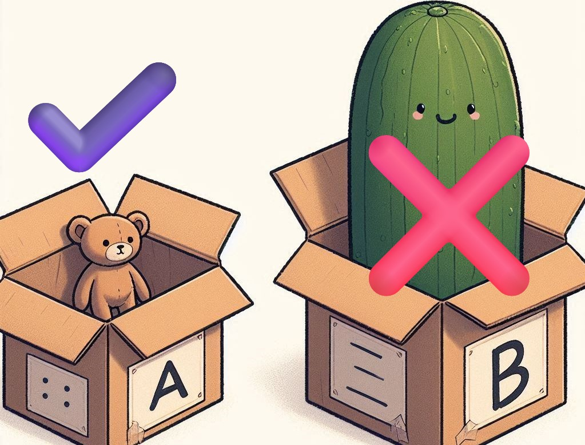

# Índice

[TOC]

------

# Introducción a Java


**Java es un lenguaje de programación orientado a objetos, multiplataforma, robusto y fuertemente tipado**. La plataforma Java proporciona, además de un  lenguaje de programación, todo un conjunto de especificaciones, tecnologías y librerías de clases, mediante los cuales se pueden crear diferentes tipos de programas informáticos capaces de ser ejecutados en una amplia variedad de sistemas operativos.

Esta independencia, tanto del sistema operativo como del dispositivo, ha contribuido a expandir el lenguaje y a que numerosos fabricantes de software hayan apostado por el, y que a día de hoy siga siendo la principal opción para numerosas empresas y programadores a la hora realizar sus desarrollos.


## JDK y JRE

**JDK (Java Development Kit)** es un conjunto de herramientas de programación que incluye todo lo necesario para desarrollar aplicaciones Java. Incluye el compilador Java, el depurador, las bibliotecas y las utilidades necesarias para crear y probar aplicaciones Java. Un elemento importante de la JDK es la JVM o máquina virtual de Java. Lo explicamos en el siguiente punto.

Por otro lado, **JRE (Java Runtime Environment)** es un conjunto de programas y librerías que proporcionan un entorno de ejecución para las aplicaciones Java. JRE es necesario para ejecutar cualquier aplicación Java. Incluye el motor de Java, las bibliotecas y los componentes necesarios para ejecutar una aplicación.

**En resumen, JDK es necesario para desarrollar aplicaciones Java, mientras que JRE es necesario para ejecutar aplicaciones Java**. Es importante tener en cuenta que si se tiene JDK se tiene JRE porque viene incluida, pero se puede tener instalada solo la JRE sin tener JDK.


## Máquina Virtual de Java (JVM)

La **Máquina Virtual de Java** (JVM, por sus siglas en inglés) es un componente clave de la plataforma Java. Es un intérprete de código que se encarga de ejecutar las aplicaciones Java. La JVM es independiente del sistema operativo y del hardware, lo que significa que una aplicación Java puede ser ejecutada en cualquier plataforma que tenga una JVM instalada.

La JVM carga el código byte (o *byte code*) compilado de una aplicación Java, lo verifica y lo ejecuta. El código byte es el resultado de compilar el código fuente de una aplicación Java. La JVM también se encarga de gestionar la memoria y los recursos del sistema, como la gestión de memoria dinámica y la gestión de excepciones.

Además, la JVM es responsable de proporcionar seguridad a las aplicaciones Java al controlar el acceso a los recursos del sistema y al aplicar restricciones de seguridad en el código.

En resumen, la **Máquina Virtual de Java es un intérprete que se encarga de ejecutar las aplicaciones Java**, independientemente del sistema operativo o el hardware en el que se ejecuta. Es responsable de cargar, verificar y ejecutar el código byte de una aplicación, así como de gestionar la memoria y los recursos del sistema y proporcionar seguridad a las aplicaciones.


## Compilación de un programa Java

El proceso de compilación de un programa Java es el siguiente:

1. El desarrollador escribe el código fuente de la aplicación en un archivo con extensión `.java` utilizando un editor de texto o un entorno de desarrollo integrado (IDE).
2. El código fuente es compilado utilizando el compilador de Java, que se encuentra en el JDK (Java Development Kit). El compilador analiza el código fuente y lo convierte en código byte, que es el lenguaje que entiende la JVM (Máquina Virtual de Java).
3. El compilador genera un archivo con extensión `.class` para cada clase declarada en el archivo `.java`. Los archivos `.class` contienen el código byte de la aplicación.
4. Una vez generados los archivos `.class`, estos pueden ser ejecutados en cualquier plataforma que tenga una JVM instalada, ya que la JVM es independiente del sistema operativo y del hardware.
5. Durante la ejecución, la JVM carga los archivos `.class` y los interpreta para ejecutar las instrucciones contenidas en ellos.

Es importante mencionar que el **código byte generado en el proceso de compilación no es legible para los humanos**, ya que se encuentra en un formato binario. Sin embargo, el código byte es fácilmente interpretable por la JVM, lo que permite que una aplicación Java se ejecute en cualquier plataforma compatible (como podemos ver en el esquema anterior).

> [!IMPORTANT]
>
> **No tendremos que preocuparnos por hacer todo este proceso ya que lo realizan los IDEs**. Tu solo has de escribir el código fuente en el IDE que tendrá mecanismos para iniciar todo el proceso de compilación y ejecución automatizados. Puedes ver como cuando ejecutas el programa, suele aparecer una carpeta nueva con el archivo `.class`, el cual es ejecutado y mostrado su resultado por una consola.

---

# Comentarios en Java

Los **comentarios** son notas que puedes agregar en tu código para explicar qué está haciendo o para recordar algo importante. Son muy útiles, especialmente cuando trabajas en proyectos grandes o cuando vuelves a mirar tu código después de un tiempo. Lo mejor de todo es que los comentarios no afectan la ejecución de tu programa; Java simplemente los ignora.

## Tipos de comentarios

En Java, hay dos tipos de comentarios:

1. **Comentarios de una sola línea**: Se utilizan para notas cortas. Empiezan con dos barras `//`. Todo lo que escribas después de `//` en esa línea será ignorado por Java.

   **Ejemplo:**

   ```java
   // Este es un comentario de una sola línea
   int numero = 5;  // Aquí estoy declarando una variable
   ```

2. **Comentarios de varias líneas**: Se utilizan cuando necesitas escribir más de una línea de comentarios. Empiezan con `/*` y terminan con `*/`. Todo lo que esté entre esos dos símbolos será ignorado.

   **Ejemplo:**

   ```java
   /* Este es un comentario
      de varias líneas. Aquí
      puedo explicar más a fondo
      lo que hace el código. */
   int resultado = 10 + 20;  // Suma 10 y 20
   ```

## ¿Por qué son importantes los comentarios?

- **Claridad**: Ayudan a que tú y otros programadores entiendan mejor el código. Es como dejar pistas para el futuro.
- **Mantenimiento**: Si tienes que volver a mirar tu código más adelante, los comentarios te recordarán qué estaba pasando.
- **Colaboración**: Si trabajas en equipo, los comentarios son una forma de comunicarte con tus compañeros sobre lo que hace cada parte del código.

## Consejo

No abuses de los comentarios. Si tu código es claro y fácil de entender, es posible que no necesites explicar cada línea. Usa comentarios para aclarar la lógica o para notas importantes, pero evita hacer comentarios obvios (como el del ejemplo anterior 🙄).

Los comentarios son una herramienta esencial en la programación, y usarlos correctamente te hará un mejor programador y sobre todo... mejor persona 😜.

---

# Tipos de datos

**Java es un lenguaje fuertemente tipado**, y se ha de especificar los tipos de datos en la creación de variables, objetos, atributos, valores devueltos por los métodos y parámetros recibidos por los métodos. 

## Variables

En programación, una variable está formada por un espacio en memoria y un nombre simbólico, llamado **identificador**, que queda asociado a dicho espacio. En ese espacio se podrá almacenar un **valor**. Usaremos el identificador para hacer referencia al valor almacenado en memoria. El valor de la variable puede cambiar durante la ejecución del programa.


Imagina que tienes una cajita en la que puedes guardar cosas, y a esa cajita le pones un nombre. En Java, a esas cajitas las llamamos **variables**. Pueden guardar casi cualquier cosa: números, letras, palabras... ¡lo que quieras!

```java
int miNumero = 5;
```

En este caso, hemos creado una cajita llamada <kbd>miNumero</kbd> y hemos guardado un 5 dentro. ¡Así de simple! Y si un día decides que en vez de un 5 quieres guardar un 10, solo tienes que cambiarlo. 

### Reglas para los identificadores

<div style="border: 1px solid red; background-color: #f8d7da; color: #721c24; padding: 15px; border-radius: 5px; text-align: center; font-family: Arial, sans-serif;">
    <p style="font-size: 1.5rem">🚨⚠️MUY IMPORTANTE⚠️🚨</p>
	<p>
        Las siguientes normas son de las más importantes de todo Java. Presta especial atención.
    </p>
</div>

Las variables tienen nombres llamados **identificadores**, y esos nombres deben cumplir unas reglas:

- Deben empezar por una letra y en minúscula. En Java se usa la notación camelCase.
- Pueden contener números, pero no podrán empezar por un número.
- No pueden usarse tildes, ni signos de puntuación, ni caracteres especiales.
- No podrán usarse palabras reservadas para el lenguaje.
- Identificadores válidos serían: `contador`, `contador3`, `c`, `x2`, `contadorVocales`.
- Identificadores no válidos serían: `1contador`, `123`, `c%`, `x-y`, `?min`, `año`, `spidermán`. (Realmente si funcionaría la ñ y las tildes, pero nos provocarán muchos errores futuros, así que mejor tratarlos como no válidos.)

Para **definir una variable** (también llamado declarar) de un tipo de dato concreto, se usará la sintaxis siguiente:

```
<tipoDeDato> identificador;
```

Para poder usar una variable (operar con ella, mostrar su valor, etc), Java nos obliga a darle un valor inicial. Esto se llama **inicializar**. Para asignar un valor a una variable ya declarada, usaremos el operador de asignación `=`.

```
identificador = valor;
```

También se puede hacer la **declaración e inicialización** en una misma sentencia:

```
<tipoDeDato> identificador = valor;
```

Veamos los primeros tipos de datos en Java, antes de poder definir una variable.

## Tipos primitivos

También llamados atómicos, puesto que son las unidades más pequeñas con las que podemos trabajar en Java. Los objetos estarán formados por otros objetos o bien por tipos primitivos. Los tipos primitivos en Java son:

> [!NOTE]
>
> Se marcan con el icono de favorito (⭐) los tipos más usados.

| Nombre              | Declaración | Descripción                                                  | Memoria | Rango                                              |
| ------------------- | ----------- | ------------------------------------------------------------ | ------- | -------------------------------------------------- |
| ⭐Booleano           | `boolean`   | Define una variable que puede tomar dos posibles valores. `true` o `false`. Aunque solo requeriría un bit, lo mínimo almacenable en memoria es un byte. | 1 byte  | `true` o `false`                                   |
| Byte                | `byte`      | Define una variable entera pequeña.                          | 1 byte  | [-128 ... 127]                                     |
| Short               | `short`     | Define una variable entera corta.                            | 2 bytes | [-32.768 … 32.767]                                 |
| ⭐Entero             | `int`       | Define una variable entera estándar. Suele ser la más usada para representar un número entero. | 4 bytes | [-2<sup>31</sup> ... 2<sup>31</sup>-1]             |
| Entero largo        | `long`      | Define una variable entera con un mayor rango, pero ocupa el doble en memoria. | 8 bytes | [-2<sup>63</sup> ... 2<sup>63</sup>-1]             |
| Decimal simple      | `float`     | Define una variable real estándar.                           | 4 bytes | [±3,4·10<sup>-38</sup> … ±3,4·10<sup>38</sup>]     |
| ⭐Decimal doble      | `double`    | Define una variable real con doble precisión. Ocupa el doble que `float` en memoria. | 8 bytes | [±1,7·10<sup>-308</sup> ... ±1,7·10<sup>308</sup>] |
| Carácter            | `char`      | Define una variable que podrá almacenar un único carácter o su código ASCII. Se delimita con comillas simples. Ejemplo: `'a'`. | 2 bytes | [0 .. 65.535]                                      |
| ⭐String<sup>1</sup> | `String`    | Define una variable que podrá almacenar una cadena de caracteres. Se delimita con comillas dobles. Ejemplo: `"Hola Mundo"`. |         |                                                    |

> [!IMPORTANT]
>
> **Nota<sup>1</sup>:** El tipo de datos `String` NO ES una variable de tipo primitivo. Ya se verá más adelante a fondo. La incluimos aquí porque podemos catalogarla como **básica** e incluirla “moralmente” entre los tipos primitivos aunque técnicamente no lo sea.

Una vez que ya hemos visto las variables, sus tipos de datos, y la sintaxis para declarar e inicializar variables, veamos nuestras primeras líneas de código real en Java, dónde **definimos** una variable de cada tipo y las **inicializamos** a un valor válido:

```java
//Booleanas
boolean esCorrecto = true; 	//true o false

//Enteros
byte b = 127;				//entre -128 y 127
short s = 32767;			//entre -32768 y 32767
int i = 2147483647;			//tipo entero
long l = 2150000000L;		//tipo entero largo;

//Decimales
float f = (float) 7.5;		//tipo float (decimal con simple precisión)
double d = 9.573;			//tipo double (decimal con doble precisión)

//char
char letra1 = 'A';			//Los char se pueden tratar indistintamente como un carácter 
char letra2 = 65;			//o como un número
char letra3 = 'B' + 1;		//Esto NO DARÍA B1, si no 'C'

//String
String curso = "Desarrollador/a Fullstack"; //No sería un primitivo, pero casi ;)
```

## Literales

Se denominan **valores literales** a aquellos datos que son introducidos en el código del programa directamente en forma de constantes. Suelen usarse para asignar un valor inicial a una variable o como parte de una expresión aritmética o de otro tipo.

- `int a = 15;` –> **15** sería un literal de número. 
- `String cadena = "Hola Mundo!";` –> **Hola Mundo** sería un literal de String.

En Java, los literales también tienen su tipado, y siguen las siguientes reglas:

- Los literales numéricos, sean del tipo que sean, no se delimitan con ningún carácter.
- Los literales de números enteros, que no se definan explícitamente de un tipo, serán tomados como tipo `int`.
- Los literales de números decimales, que no se definan explícitamente de un tipo, serán SIEMPRE definidos como tipo `double`. 
- Los literales de cadenas, se delimitan por comillas dobles `""`.
- Los literales de carácter, se delimitan por comillas simples `''` ,  o bien por un número entero (ver ejemplo anterior).
- Los literales booleanos, serán `true` o `false`.

<div style="border: 1px solid red; background-color: #f8d7da; color: #721c24; padding: 15px; border-radius: 5px; text-align: center; font-family: Arial, sans-serif;">
    <p style="font-size: 1.5rem">🚨⚠️MUY IMPORTANTE⚠️🚨</p>
	<p>Las reglas arriba indicadas son muy importantes. Importantísimas. MUY IMPORTANTES. MUCHO. Avisados estáis 🫵.</p>
</div>

Los tipos de datos numéricos, siempre que no se pierda información, pueden “caber” en variables de tipo de dato de igual tipo o más grande, no necesitando ninguna conversión explícita. 

Si visualizamos el valor como un objeto cualquiera, y la variable como una caja de cartón, entenderemos que nunca podremos guardar un objeto grande en una caja pequeña, pero si al revés. Es decir, no podremos guardar un valor `double` dentro de una variable `float`, pero si podremos guardar un valor `int` en una variable `double` o `float`.

```java
int a = 15;    //El 15, es un entero, que se mete en una variable de tipo entero. Correcto.
float b = 3;   //El 3, es un entero, que se mete en una variable de tipo float. Correcto.
float c = 2.4; //El 2.4, es un DOUBLE, que se mete en una variable de tipo float. ERROR. No cabe.
```



### Conversiones de tipo (casting)

En Java, los datos los podemos convertir de un tipo de dato a otro, siempre que sean compatibles. Algunas conversiones se producen de forma automática (implícita) y otras veces tenemos nosotros que forzar dicha conversión. A esta técnica también se le llama **`casting`**.

A continuación veremos las distintas formas y ocasiones en la que transformaremos unos tipos de datos en otro. 


#### 🟪Conversiones explícitas 

**Son las conversiones producidas manualmente por nosotros** para forzar una conversión de un tipo de datos a otro.

Por ejemplo: Si queremos guardar un valor literal decimal en una variable de tipo `float`, deberemos convertir explícitamente el valor a `float`, ya que un literal decimal de forma predeterminada es de tipo `double` y no cabría en un `float`.

```java
float nota = 8.3;		  //Daría error, ya 8.3 es un valor double
float nota = (float) 8.3; //Así convertimos explícitamente el double a float (casting)
float temp = 25.8f;       //Así también, pero no se recomienda.
```

Para guardar un literal numérico en un `long`, que supere el rango de los enteros, deberemos convertir explícitamente también el número a `long`, ya que un número literal por defecto es de tipo `int`, y si este supera el rango permitido, dirá que nos estamos saliendo del  rango. Para convertirlo explícitamente, usaremos la letra `L` al final del número para indicar que es `long`.

```java
long largo = 3147000000L; 
```


#### 🟪Conversiones implícitas

**Son las conversiones producidas de forma automática por Java**, sin que explícitamente indiquemos el tipo de dato resultante.

Veamos las más comunes:

Al dividir dos números de tipo entero, el resultado será de tipo entero y no de tipo decimal, sea cual sea la operación:

```java
int a=10;
System.out.println(a/2); //El resultado es -> 5
System.out.println(a/3); //El resultado es -> 3. No da 3.333333
```

Si queremos realizar una división que el resultado de decimales, deberemos usar en la expresión algún tipo de dato con decimales, como `float` o `double`, ya que tipo de dato del resultado de una expresión, será el tipo de dato mayor involucrado en la operación.

```java
int a=10;
System.out.println(a/2.0); //El resultado es -> 5.0
System.out.println(a/3.0); //El resultado es -> 3.3333333
```

En el ejemplo anterior, ambos resultados dan decimales, porque ya no estamos dividiendo un `int` entre un `int` como antes, si no un `int` entre un `double` (recuerda que un literal decimal SIEMPRE es `double`). Como resultado de la operación, el tipo de dato resultante será el mayor involucrado, para que no se pierda información en la operación.

Veamos otra posibilidad:

```java
float division1 = 5 / 2;		//Daría 2, y se guardaría 2.0
float division2 = 5 / 2.0;		//Error
float division3 = 5 / 2f;		//Funcionaría
float division4 = 5 / (float) 2;//Funcionaría
```

- Línea 1: Dividimos `5 / 2`, ambos enteros, el resultado es entero, y al guardarse en un `float`, se guardaría `2.0`.
- Línea 2: Dividimos `5 / 2.0`, un `int` entre un `double`, el resultado es `double`, por lo que no podemos almacenarlo en un `float` y provocará error.
- Línea 3: Dividimos `5 / 2f`. Un `int` entre un `float`, el resultado es `float`, y se puede almacenar perfectamente en un `float`.
- Línea 4: Lo mismo que la línea 3.

Con los String también tenemos conversiones implícitas:

**Para convertir de char a String:**

```java
char letra = 'Y';
String nif = "11223344" + letra; //Resultado -> "11223344Y"
```

Si concatenamos un `char` a un `String`, el resultado será `String`.

**Para convertir números (da igual el tipo) a String:**

```java
String nombre = "Max Power";
float cantidad = 3000;
System.out.println("Hola " + nombre + ", te queremos " + cantidad);
//Sale por pantalla -> "Hola Max Power, te queremos 3000"
```

En la expresión anterior, empezamos concatenando `"Hola " + nombre + ", te queremos "`. Sumamos 3 valores de `String`, que al concatenarlos obtenemos `Hola Max Power, te queremos `. Pero después le concatenamos un número. Ahí se hace una conversión implícita. El número se convierte a `String`, pasando de `3000 a "3000"`, y se concatena al resto del `String`. 


## Constantes

Una constante en Java es una “variable” que su valor no podrá ser modificado después de su inicialización. A todos los efectos funciona exactamente igual que una variable, con la diferencia que si intentamos asignarle un valor cualquiera una vez que ya tenga su valor inicial, provocará un error de compilación y el propio IDE nos indicará el error.

Las constantes se declaran igual que las variables, teniendo en cuenta dos puntos:

- Hay que **añadirle el modificador `final`** antes del tipo de dato, sea el que sea.
- Por convención, el identificador de una constante, **se escribirá entero en mayúsculas**. Si tiene varias palabras se usará guion bajo para separarlas.

```java
final double PI = 3.141592653589793;
final String COLOR_ROJO = "\033[31m";
```


---

# Expresiones

Una **expresión** en programación es una combinación de valores, variables, operadores y funciones que se evalúan para obtener un resultado. Las expresiones son fundamentales porque permiten realizar cálculos y manipular datos dentro de un programa.

Imagina que la asignación es como una flecha que apunta a un sitio donde vas a guardar algo. A la izquierda de la flecha pones el nombre de tu cajita (la variable), y a la derecha pones la fórmula (la expresión) que le dice a Java qué debe guardar dentro de esa cajita.

**Ejemplo:**

```java
int resultado = 5 + 3;
```

Aquí tenemos:

- **Izquierda**: `int resultado` (el nombre de la caja y su tipo de datos).
- **Derecha**: `5 + 3` (la expresión que Java resuelve).

El `=` no significa "igual a", sino más bien "mete lo de la derecha en la cajita de la izquierda". O sea, ¡**la expresión siempre va en la derecha para que Java calcule y luego lo guarde**!


## Sentencias

En Java, escribir una expresión por sí sola no sirve de nada. Si solo pones algo como `5 + 3;` en una línea, Java se confunde y te dice: "¡¿Qué hago con esto?!". Esto es porque las expresiones necesitan que hagas **algo** con ellas, como guardarlas en una variable, imprimirlas, o usarlas para tomar una decisión.

**Ejemplo de una expresión no válida:**

```java
5 + 3;
```

Java te daría un error aquí porque no estás diciendo qué hacer con el resultado de `5 + 3`. La expresión por sí sola **no es una sentencia válida**.

**¿Qué es una sentencia válida?**

Para que una expresión tenga sentido en Java, debe formar parte de una **sentencia** que le diga a Java qué hacer con el resultado. Por ejemplo:

1. **Asignar el resultado a una variable**:

   ```java
   int resultado = 5 + 3;  // Aquí estamos guardando el resultado en una cajita (variable).
   ```

2. **Imprimir el resultado en la consola**:

   ```java
   System.out.println(5 + 3);  // Aquí le decimos a Java que imprima el resultado en la pantalla.
   ```

3. **Usar la expresión en una condición** (las veremos más adelante):

   ```java
   if (5 + 3 == 8) {
       System.out.println("¡Es correcto!");
   }
   ```

En estos ejemplos, las expresiones **tienen un propósito**: guardan el resultado, lo muestran en pantalla o lo usan para tomar una decisión. Así que recuerda, en Java no basta con escribir una expresión sin más; siempre debes decirle a Java **qué hacer con ese resultado** para que sea una sentencia válida.

> [!IMPORTANT]
>
> 🚨🚨🚨**En Java, todas las sentencias terminan con el símbolo punto y coma** (**`;`**). 🚨🚨🚨


## Tipos de expresiones

Hay varios tipos de expresiones, dependiendo del valor obtenido o de los operadores usados.

### 🟪Expresiones Aritméticas

Siempre darán como resultado un valor. Son como las cuentas que hacías en la escuela, solo que ahora le estás enseñando a Java a hacerlas por ti. Usamos operadores para decirle a Java qué hacer con los números. Los operadores más comunes son:

| Operador | Significado                | Ejemplo              |
| -------- | -------------------------- | -------------------- |
| `+`      | Suma                       | `5 + 3` (esto da 8)  |
| `-`      | Resta                      | `9 - 2` (esto da 7)  |
| `*`      | Multiplicación             | `4 * 2` (esto da 8)  |
| `/`      | División                   | `10 / 2` (esto da 5) |
| `%`      | Módulo (resto de división) | `10 % 3` (esto da 1) |

Ejemplo de una expresión aritmética:

```java
int resultado = 5 + 3 * 2;     // resultado = 11
int media = 7 + 2 + 0 + 7 / 2; // media = 12 
```

> [!CAUTION]
>
> Precaución con la prioridad de las operaciones matemáticas. Lo veremos más adelante.


### 🟪Expresiones Lógicas

Las expresiones lógicas le enseñan a Java a decidir si algo es **verdadero** o **falso** (`true` o `false`). Aquí es donde Java empieza a hacer preguntas como "¿Es esto mayor que aquello?", "¿Son iguales?". Usa operadores lógicos (símbolos) para hacer estas comparaciones.

Una expresión lógica (también llamada booleana) solo puede tener un único resultado y **siempre será o `true` o `false`.** No hay más posibilidades.

**Operadores lógicos comunes:**

| Operador | Significado       | Ejemplo                    |
| -------- | ----------------- | -------------------------- |
| `==`     | Igual a           | `5 == 5` (esto es `true`)  |
| `!=`     | Diferente de      | `5 != 3` (esto es `true`)  |
| `>`      | Mayor que         | `7 > 3` (esto es `true`)   |
| `<`      | Menor que         | `2 < -1` (esto es `false`) |
| `>=`     | Mayor o igual que | `6 >= 6` (esto es `true`)  |
| `<=`     | Menor o igual que | `4 <= 2` (esto es `false`) |

**Ejemplo de una expresión lógica:**

```java
boolean esMayor = 7 > 5;
```

Aquí, Java está comprobando si 7 es mayor que 5. Si lo es (¡y lo es!), entonces la variable `esMayor` será **true** (verdadero).


> [!TIP]
>
> También puedes combinar estas expresiones, usando partes aritméticas y partes lógicas.
>
> ```java
> int numero = 10;
> boolean esDivisiblePorDos = numero % 2 == 0;
> ```
>
> Aquí, le estamos diciendo a Java que compruebe si el número es divisible por 2. Si lo es, entonces `esDivisiblePorDos` será **true**. Primero ha obtenido el resto de la división con el operador `%`, y si ese número es igual a `0` es porque es divisible por 2, por lo que el resultado total de la expresión es `true`.


#### Operadores Lógicos: AND, OR y NOT

Podemos combinar expresiones lógicas con otros operadores lógicos. Sirven para crear expresiones lógicas mucho más complejas y potentes.

| Operador | Significado | Ejemplo               | Resultado                            |
| -------- | ----------- | --------------------- | ------------------------------------ |
| `&&`     | AND (Y)     | `(5 > 3) && (8 > 6)`  | **true** (ambas son verdaderas)      |
| `||`     | OR (O)      | `(5 > 3) || (8 < 6) ` | **true** (al menos una es verdadera) |
| `!`      | NOT (No)    | `!(5 > 3)`            | **false** (invierte el resultado)    |


🟣**AND (`&&`): ¡Los dos tienen que decir "sí"!**

El operador **AND** funciona como si estuvieras en una puerta con dos guardias. Solo puedes pasar si **ambos** dicen que sí. Es decir, las dos condiciones tienen que ser verdaderas para que el resultado sea **true**.

```java
boolean esAdulto = (edad >= 18) && (tieneDNI == true);
```

Aquí, para que `esAdulto` sea **true**, Java necesita que **ambas** cosas sean verdaderas: la persona debe tener al menos 18 años **y** tener su DNI.

🟣**OR (`||`): ¡Con que uno diga "sí", ya vale!**

El operador **OR** es más relajado. Solo necesitas que **una** de las condiciones sea verdadera para que el resultado sea **true**. Es como si tuvieras dos puertas, y con que una esté abierta, ya puedes pasar.

```java
boolean puedeEntrar = (tieneInvitacion == true) || (estaEnLista == true);
```

En este caso, `puedeEntrar` será **true** si la persona tiene una invitación **o** está en la lista, ¡con que una de esas condiciones sea cierta, basta!

**🟣NOT (`!`): ¡Dale la vuelta!**

El operador **NOT** es el rebelde del grupo, siempre va en contra. Si una condición es **true**, él la convierte en **false**, y si es **false**, la convierte en **true**. Es como un interruptor que invierte el resultado.

```java
boolean noEsMayor = !(edad >= 18);
```

Aquí, si `edad >= 18` es **true** (la persona es mayor de edad), el operador **NOT** lo convierte en **false**. Así que `noEsMayor` sería **true** solo si la persona **no** tiene 18 años o más.

🟣 **Operadores.... reuníos**


Puedes combinar estos operadores para hacer decisiones más complejas y potentes, como:

```java
boolean puedeComprarEntrada = (edad >= 18) && (tieneDinero || tieneInvitacion);
```

Aquí le estamos diciendo a Java que la persona solo puede comprar la entrada si tiene al menos 18 años **y** además tiene dinero **o** tiene una invitación.


### 🟪Expresiones de concatenación

Las expresiones que combinan textos (o cadenas de caracteres, también llamados **Strings**) no son ni aritméticas ni lógicas, son expresiones de concatenación.

Cuando en Java unes dos textos (Strings) usando el símbolo `+`, estás **concatenando**, es decir, pegando las palabras una al lado de la otra para formar una frase más larga. Los Strings pueden estar formados de cualquier carácter alfanumérico.

**Ejemplo de concatenación:**

```java
String saludo = "Hola" + " Mundo"; //saludo = "Hola Mundo"
String texto = "12" + "34";        //texto = "1234"
```

En el primer ejemplo, Java agarra las dos palabras y las pega para formar `"Hola Mundo"`. Igual pasa con el segundo ejemplo, al estar entrecomillado, son literales de Strings y no números por lo que al usar el operador `+` no se suman, si no se pegan los caracteres que tenga el String, ya sean letras, números o cualquier otro símbolo.

> [!NOTE]
>
> Recuerda: Si mezclas un número con un texto usando `+`, Java convierte el número en texto automáticamente y los pega. ¿Cómo se llamaba esa conversión? 🤔.


```java
String mensaje = "Tengo " + 5 + " manzanas.";
```

El resultado será: `"Tengo 5 manzanas."`

> [!IMPORTANT]
>
> Recuerda añadir los espacios en blanco que necesites al concatenar textos y/o números, ya que si no saldrá todo pegado.
>
> ```java
> String nombre = "Max";
> String saludo = "Buenos días" + nombre; // --> "Buenos díasMax"
> ```


## Prioridad

Cuando Java se encuentra con una expresión llena de operadores (como `+`, `-`, `*`, `/`, etc.), no los ejecuta todos al mismo tiempo. Java sigue un orden de prioridades. Es como en la vida: algunas cosas son más urgentes que otras.

1. **Paréntesis `()`**: Todo lo que esté entre paréntesis, se hace primero.
2. **Multiplicación `\*`, División `/`, y Módulo `%`**: Estos operadores tienen el segundo lugar en importancia. Si tienes varias operaciones, Java las ejecuta de izquierda a derecha.
3. **Suma `+` y Resta `-`**: Estos vienen después de la multiplicación y la división. Si ves sumas y restas sin multiplicaciones o divisiones antes, Java las resuelve de izquierda a derecha.

Veamos unos ejemplos simples de matemáticas básicas simples:

```java
int resultado = 10 - 3 + 2; // Primero 10 - 3, luego suma 2. resultado = 9
int resultado = 2 + 3 * 4;  // Primero 3 * 4, luego suma 2. resultado = 14
int resultado = (2 + 3) * 4;// Primero 2 + 3, luego multiplicar por 4. resultado = 20
```

Veamos como de importante es el orden en la resolución de una expresión:

```java
String cadena1 = "1" + 2 + 3;   //Resultado "123"
String cadena2 = 1 + 2 + "3";   //Resultado 1+2=3 -> 3 + "3" -> "33"
String cadena3 = 1 + (2 + "3"); //Resultado 2+"3"= "23" -> 1 + "23" -> "123"
String cadena4 = "1" + (2 + 3); //Resultado (2+3=5) -> "1" + 5 -> "15"
String cadena5 = 1 + 2 + 3;     //Daría error, no puede meter un int en un String
String cadena6 = 1 + 2 + 3 + "";//Resultado 1+2+3=6 -> 6 + "" -> "6"
```

> [!TIP]
>
> Un truco poco elegante pero efectivo es el visto en el último ejemplo. Para convertir un número a un String, se le concatena una cadena vacía `""`, lo cual convierte implícitamente todo el resultado de la expresión en un String. 🐷


---

# Entrada y salida de datos

## Salida por pantalla

Para mostrar información por la consola, usaremos la función `System.out.println();`

```java
String saludo = "Hola Mundo!";
System.out.println(saludo);
```

Dicha función imprimirá el resultado de la expresión y un salto de línea al final.

Hay una versión que no imprimirá ningún salto de línea al final, que es `System.out.print();`. 

También podemos incluir nosotros el salto de línea en la posición que queramos, incluyendo el carácter `\n` en cualquier parte del `String`.

```java
System.out.print("\nHola\nMundo");
```

Esto imprimirá por consola:

```
Hola
Mundo
```

### Colores  🌈

Es posible imprimir colores por la consola de Java en diferentes IDEs. Tan sólo tendremos que imprimir un `String` concreto con un código de color y a partir de ese carácter imprimirá todo el texto en dicho color hasta que lo volvamos a cambiar. 

A continuación la lista con los códigos de color y un ejemplo para imprimir un color concreto:

```java
//Lista de colores disponibles
String black = "\033[30m";
String red = "\033[31m"; 
String green = "\033[32m"; 
String yellow = "\033[33m"; 
String blue = "\033[34m"; 
String purple = "\033[35m"; 
String cyan = "\033[36m"; 
String white = "\033[37m";
String reset = "\u001B[0m";

System.out.print(reset); //Ponemos el color por defecto
System.out.println("Este texto sale con el color por defecto...");
System.out.print(cyan); //A partir de aquí imprimimos en cyan
System.out.print("Este texto ya sale en azul");
```
 

> [!TIP]
>
> Si cambiamos los colores, permanecerán activos hasta que se reseteen o se cambien por otro color. Por lo que sería una buena práctica imprimir siempre al inicio del programa el color `\u001B[0m` (como hacemos en la línea 12 del ejemplo) para que no empezara a escribir con un color inesperado.

Aunque lo más fácil es guardar los códigos en variables para después imprimirlas cuando queramos, también podemos imprimir los códigos como parte de un String.

```java
System.out.print("\033[30m NEGRO");
System.out.print("\033[31m ROJO");
System.out.print("\033[32m VERDE");
System.out.print("\033[33m AMARILLO");
System.out.print("\033[34m AZUL");
System.out.print("\033[35m MAGENTA");
System.out.print("\033[36m CYAN");
System.out.print("\033[37m BLANCO");
```


También es posible cambiar el color de fondo y algunos estilos básicos como negrita o cursiva, aunque dependerá de la compatibilidad de la versión del IDE respecto a los códigos ANSI. 

La lista completa de códigos de escape para los colores ANSI la puedes encontrar en el siguiente enlace: https://en.wikipedia.org/wiki/ANSI_escape_code#Colors


## Entrada por teclado

> [!NOTE]
>
> 🧙‍♂️En esta sección tenemos que centrarnos únicamente en lo principal, que es leer información desde el teclado a nuestro programa. Se hablará de instancias, clases, paquetes, objetos, métodos y excepciones. Todavía no sabemos que es nada de eso, pero tenemos que decir sus verdaderos nombres porque está feo mentir y además tenemos que ir acostumbrándonos a la jerga técnica 🤓. No te impacientes. Todo se explicará en su debido momento. Lo que no entendamos lo hizo un mago.

Para leer datos desde teclado en un programa java, usaremos la clase `Scanner`. Primero instanciaremos un nuevo objeto de la clase `Scanner`. 🧙‍♂️.

```java
Scanner teclado = new Scanner(System.in); //Creamos un objeto Scanner
```

> [!IMPORTANT]
>
> 🧙‍♂️La clase `Scanner` está en el paquete `java.util`. Deberemos importar el paquete para poder usar la clase. 

Una vez creado el objeto Scanner, usaremos sus métodos para pedir el tipo de dato que necesitemos por teclado 🧙‍♂️:

```java
int edad = teclado.nextInt();
float media = teclado.nextFloat();
double valor = teclado.nextDouble();
String nombre = teclado.nextLine();
```

Cada vez que llamemos a un método de los anteriores, la ejecución de la aplicación se detendrá y esperará a que introduzcamos un valor por la consola. Al pulsar la tecla <kbd>Intro</kbd> se terminará la lectura por teclado, el valor recogido será devuelto por el método y se asignará en la variable.

No es necesario crear nuevas instancias de la clase Scanner, podemos reutilizar la misma todas las veces que necesitemos. En nuestro ejemplo, es el objeto llamado `teclado`.

### Cerrar teclado

Si no cerramos el teclado, se produce una fuga de recursos y los editores nos pueden avisar con un `warning`, por lo que podemos cerrarlo para evitar dicho aviso. Para cerrar el teclado usaremos el método `.close()` de la clase `Scanner`.

```java
Scanner teclado = new Scanner(System.in);
...
teclado.close(); // Lo cerramos cuando ya no vamos a usarlo
```

> [!CAUTION]
>
> Si cerramos el objeto scanner y después lo intentamos usar, provocará una excepción y el programa abortará la ejecución🧙‍♂️.

### Buffer de teclado

Al pedir datos por teclado, se van almacenando los caracteres pulsados en un *buffer* (memoria intermedia). Al usar los métodos `.nextInt()`, `.nextDouble()`, `.nextLine()`, etc., lo que hacen es extraer *tokens* (trozos) de ese buffer. 

Cada método extraerá lo que está buscando y lo devolverá. Pero tenemos un efecto curioso. Veamos la siguiente secuencia.

1. Al usar el método `.nextLine()`, se abre el buffer e introducimos `Max Power` y pulsamos intro, por lo que en el buffer habrá <kbd>Max Power\n</kbd>. El método extraerá todos los caracteres que encuentre hasta el `/n` y los devolverá en formato `String`.
1. Hasta aquí todo normal y controlado. Pero pidamos ahora un número.
2. Al usar el método `.nextInt()` (o cualquiera para números), se abre el buffer e introducimos `1234` y pulsamos intro, en el buffer habrá <kbd>1234\n</kbd>. El método extrae el siguiente número que encuentre en el buffer y lo devuelve con el tipo pedido (`int`, `double` o `float`). **Dejando el resto del buffer intacto**. Es decir, dejaría en su interior un <kbd>\n</kbd> residual.
3. Si en el buffer queda un <kbd>\n</kbd>, y volvemos a hacer un `.nextLine()`, tendremos un efecto inesperado. El método irá al buffer y como no está vacío, no se detiene a pedirnos nada, extrae el <kbd>\n</kbd> y sigue con la ejecución del programa.

**Problema:** Resumiendo, **después de hacer** un `.nextInt()`, `.nextDouble()` o `.nextFloat()`, **si hacemos un** `.nextLine()`, el primero lo ignorará (los sucesivos si funcionarán). Si primero pedimos el `.nextLine()` y después el `.nextInt/Float/Double()`, no existirá problemas, por lo explicado anteriormente.

**Solución:** Si pedimos un número, y después queremos pedir un String (es importante que sea en ese orden), necesitaremos limpiar el buffer tras pedir el número, haciendo:

```java
teclado.nextLine();
```

No es necesario que guardemos el resultado en ninguna variable (podemos dejar que se vaya al cielo de los `String`). Ejecutando esa línea, cuando hagamos el `.nextLine()` que necesitemos, se detendrá como debe, ya que el buffer estará vacío.

Aquí un ejemplo de todo lo explicado, secuencialmente:

```java
Scanner teclado = new Scanner(System.in);
System.out.println("Introduce tu edad y tu nombre, en ese orden:");
int edad = teclado.nextInt();  		//Se detiene para introducir una edad
String nombre = teclado.nextLine();	//Se lo salta, porque en el buffer quedó un \n de antes
String apodo = teclado.nextLine();	//Se detiene, porque el buffer ya se vació en la línea anterior
```

Y como podemos solucionarlo:

```java
Scanner teclado = new Scanner(System.in);
System.out.println("Introduce tu edad y tu nombre, en ese orden:");
int edad = teclado.nextInt();  		//Se detiene para introducir una edad
teclado.nextLine();					//Limpiamos el buffer, ya que había un \n
String nombre = teclado.nextLine();	//Se detiene, porque el buffer ya está vacío
String apodo = teclado.nextLine();	//Se detiene de nuevo, porque el buffer está vacío
```

> [!tip]
>
> **🤓**También podemos solucionarlo pidiendo los `String` en primer lugar, y después los números. O bien usando una nueva instancia de la clase `Scanner`, la cual tenga un buffer vacío.

